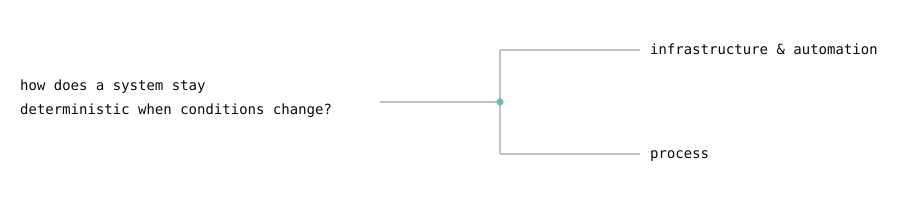

<!-- =================================================================
     anastasiabusygina / anastasiabusygina / README.md
     ================================================================= -->

<picture>
  <source media="(prefers-color-scheme: dark)" srcset="assets/banner-dark.svg">
  
</picture>

Process and DevOps manager working with automation in small software teams.

<picture>
  <source media="(prefers-color-scheme: dark)" srcset="assets/divider-dark.svg">
  
</picture>

### What I do

The work has one consistent form: **systems are connected, states are kept in sync, and processes are made explicit and repeatable.**

It appears in two layers — not separate jobs, the same work seen from two distances:

<picture>
  <source media="(prefers-color-scheme: dark)" srcset="assets/two-layer-dark.svg">
  
</picture>

| | |
|---|---|
| **Infrastructure & automation** | CI/CD pipelines, integration services, deployment tooling. Webhooks that keep two systems in sync — Linear ↔ GitHub Projects, Tilda → Notion, Discord MCP server. Reusable GitHub Actions workflows. Tailscale, Ansible, Docker, DNS. |
| **Process** | How a small team divides responsibility, records decisions, and stays legible to itself. ADRs alongside the code. Documentation written through roles, not names. The written model is the explicit form of this. |

<picture>
  <source media="(prefers-color-scheme: dark)" srcset="assets/divider-dark.svg">
  
</picture>

### Stack

<i>— v 2026.05</i>
